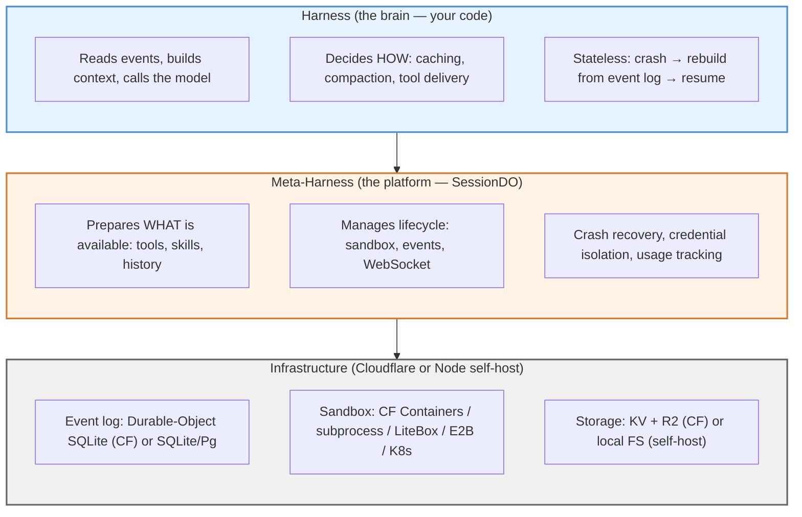
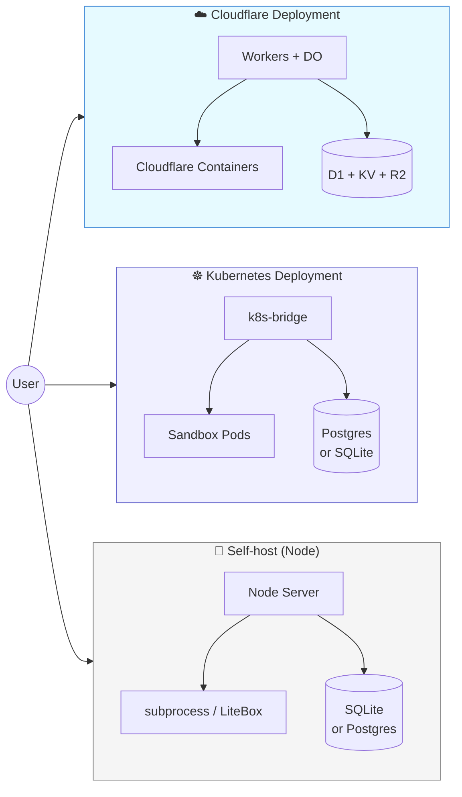
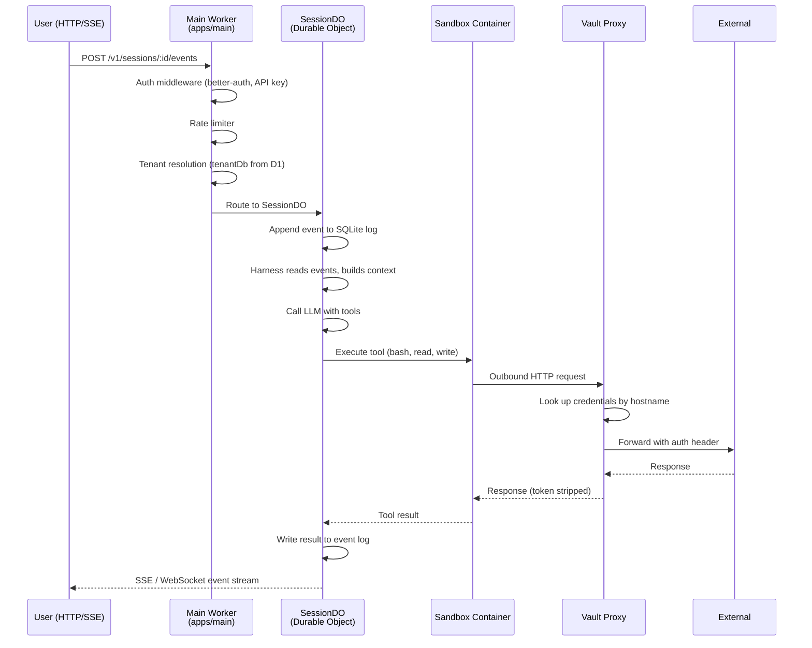
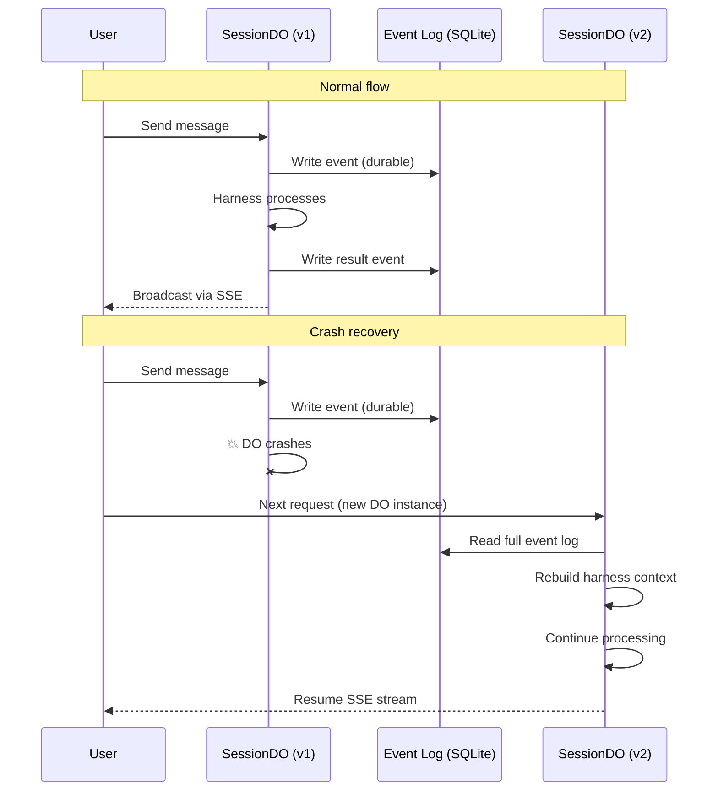
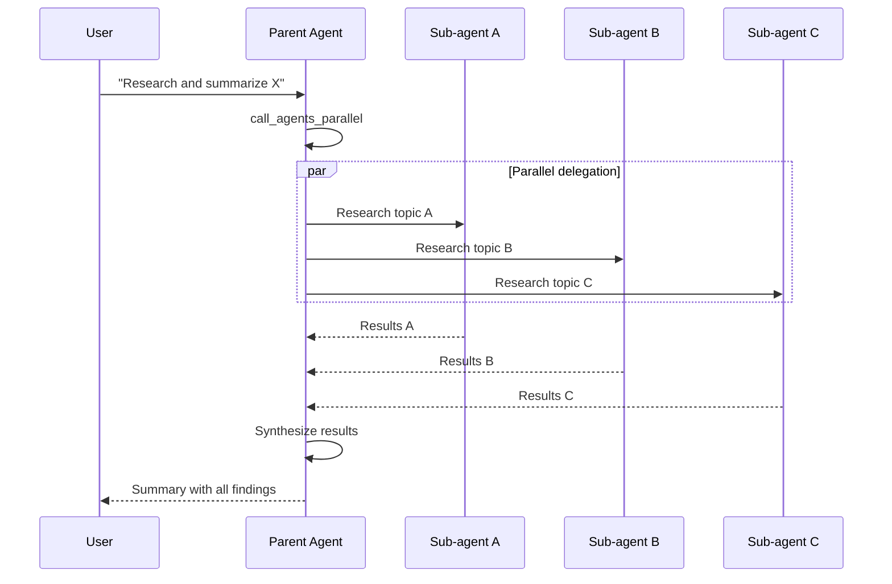

import { Aside, Card, CardGrid, LinkCard } from '@astrojs/starlight/components';

oma is built around a **meta-harness** architecture. Instead of prescribing _how_ to run an agent loop, it provides a platform that every agent loop needs: durable sessions, sandboxed execution, credential isolation, tools, memory, and crash recovery. You bring the harness (the agent loop itself) or use the built-in default.

## High-level picture



The platform prepares _what_ is available. The harness decides _how_ to deliver it to the model.

| Platform manages | Harness decides |
|---|---|
| Event log persistence (SQLite) | Context engineering (filtering, ordering) |
| Sandbox lifecycle (containers) | Caching strategy (cache breakpoints) |
| Tool registration (built-in + MCP) | Compaction strategy (when to compress) |
| WebSocket broadcast | Retry strategy (backoff, transient detection) |
| Crash recovery | Stop conditions (max steps, completion signals) |
| Credential isolation (vaults) | System prompt construction |
| Memory (vector search) | Tool delivery (all at once vs. progressive) |

## Deployment options



## Two deployment modes

oma runs the same code in two different environments. The harness, business logic, and event-log model are identical — only the storage and sandbox backends differ.

| | **Self-host (Node)** | **Cloudflare** |
|---|---|---|
| Where it lives | Your VPS / Mac / Docker host / fly.io | Cloudflare Workers + DO + Containers |
| Storage | SQLite or Postgres + local FS | D1 + KV + R2 |
| Sandbox | LocalSubprocess / LiteBox / Daytona / E2B / BoxRun | Cloudflare Sandbox (Containers) |
| Startup | `docker compose up` (~2 min) | `wrangler deploy` (~10 min once configured) |

**Same API.** Same `/v1/agents` / `/v1/sessions` API. Same Console UI. Same crash-recovery semantics. Switch between them by changing env vars, not code.

## Core data flow

A typical request flows through the system like this:



### Step by step

1. **Request arrives** at `apps/main` — the HTTP API worker. Auth is validated, the tenant is resolved, and the request is routed to the appropriate handler.

2. **SessionDO** (`apps/agent`) is a Durable Object that owns a single session's state. Every session gets its own DO instance with a dedicated SQLite database for the event log.

3. **Harness** runs inside the SessionDO. The default harness reads the event log, builds context, calls the LLM, processes tool calls, and writes new events back to the log.

4. **Sandbox** is a Cloudflare Container (or local subprocess in self-host mode) where tool commands actually execute. Each session gets its own sandbox instance.

5. **Vault proxy** sits between the sandbox and the internet. When a tool makes an HTTP request, the proxy intercepts it, looks up the session's vault credentials, injects the auth header, and forwards. The sandbox never sees the raw token.

6. **Events stream** back to the user via SSE (`GET /v1/sessions/:id/events/stream`). The stream replays history on connect and pushes new events in real-time.

## Key components

### Main Worker (`apps/main`)

The HTTP API layer: agent CRUD, session management, environment config, vaults, memory stores, skills, files, integrations webhooks, and the billing API proxy. All public REST endpoints live here.

It is a thin orchestration layer — it validates auth, resolves the tenant context, and delegates to the appropriate service or Durable Object.

### Agent Worker (`apps/agent`)

The execution layer: SessionDO (the per-session Durable Object), Sandbox (container orchestration), and the harness runtime. This is where the model is called, tools run, and events are logged.

Each SessionDO holds:
- An append-only event log in DO-storage-backed SQLite
- The harness instance currently driving the session
- Session metadata (agent config snapshot, environment, vault bindings)

### SessionDO

The heart of the system. A Durable Object that:
- Owns the append-only event log (SQLite via `ctx.storage.sql`)
- Runs the harness loop (model calls, tool execution)
- Manages sandbox lifecycle (start, keep-alive, stop)
- Broadcasts events to SSE clients
- Handles crash recovery (rebuilds context from the event log)

The event log is the source of truth. Every model message, tool call, tool result, and lifecycle event is durably written before being broadcast. If the DO crashes, a new instance reads the log, rebuilds the harness state, and resumes transparently.

### Harness

The agent loop itself. The **DefaultHarness** (built on the Vercel AI SDK's `generateText`) works out of the box:

```ts
// Simplified — the harness:
1. Reads events from the log
2. Builds messages array for the model
3. Calls the model with tools
4. Executes tool calls in the sandbox
5. Writes results back to the event log
6. Repeats until stop condition is met
```

You can replace it with a custom harness — see [Custom Integrations](/build/integrations/).

### Sandbox

Where tool commands execute. On Cloudflare, each session gets a per-session container. In self-host mode, the sandbox can be:

| Provider | Isolation | Use case |
|---|---|---|
| `subprocess` | None | Fastest, local dev |
| `litebox` | Firecracker microVM | Lightweight isolation |
| `daytona` | Firecracker microVM | Managed sandbox |
| `e2b` | Firecracker microVM | External provider |
| `boxrun` | Container | Docker-based isolation |
| `cloud` (CF) | Cloudflare Container | Production on Workers |

### Vault & Credential Proxy

Credentials never enter the sandbox. The outbound proxy intercepts HTTP requests from the sandbox, looks up the session's vault for a matching credential (by hostname), injects the auth header, and forwards. The sandbox process never sees the raw token.

Supported credential types:
- `static_bearer` — static tokens matched by hostname
- `mcp_oauth` — OAuth tokens with auto-refresh on 401/403
- `cap_cli` — CLI tools (`gh`, `aws`, `wrangler`, etc.) authenticated at the network layer

See [Vault & MCP](/build/vault-and-mcp/) for the full design.

### Integrations Gateway (`apps/integrations`)

A separate worker that handles OAuth flows and webhooks for third-party integrations (Linear, GitHub, Slack). Each integration:
1. Registers a webhook endpoint on the integrations worker
2. Receives events (issue assigned, PR review requested, Slack @mention)
3. Converts them to `user.message` events on the appropriate session
4. The agent responds through MCP tools bound to the external service

## Crash recovery

The event log makes crash recovery automatic:

1. SessionDO crashes mid-execution
2. A new DO instance is created on the next request
3. The new instance reads the full event log from DO storage
4. The harness rebuilds its context from the events
5. Processing continues from where it left off

No data is lost because events are durably written to SQLite **before** being broadcast. The client sees a brief delay while the new instance boots, then the event stream resumes.



## Multi-agent delegation

Agents can delegate work to other agents using `callable_agents`. When an agent has callable agents configured, the platform generates:

- **`call_agent_<name>`** — one-at-a-time delegation (blocks until the child reaches idle)
- **`call_agents_parallel`** — fan-out to multiple children concurrently (capped at 5-10 parallel calls)



Each child session gets its own SessionDO with its own event log, sandbox, and credential bindings. Results are aggregated back to the parent.

See [Agent configuration](/reference/configuration/) for the `callable_agents` schema.

## Session resources

Sessions can be augmented with external resources at runtime:

| Resource type | Description |
|---|---|
| **File** | Mount a file into the sandbox at a specific path |
| **GitHub repository** | Clone a repo into the sandbox (read-only or read-write) |
| **Memory store** | Mount a persistent memory store at `/mnt/memory/<name>/` |

Resources are attached via `POST /v1/sessions/:id/resources` and removed via `DELETE /v1/sessions/:id/resources/:resId`.

## Observability

The platform emits structured events for every operation:

| Event | Description |
|---|---|
| `span.model_request_start` | Model API call started |
| `span.model_request_end` | Model API call completed (includes token usage) |
| `span.outcome_evaluation_start` | Outcome evaluation began |

These flow through Cloudflare Analytics Engine and can be consumed for monitoring, billing, and debugging. The Console surfaces key metrics (session count, active seconds, credits) on the Dashboard.

## Source map

Two runtime flavors of the same control-plane API: `apps/main` (Cloudflare Worker) and `apps/main-node` (self-host Node.js server, same API, packaged for `docker compose`).

| Layer | Cloudflare | Self-host |
|---|---|---|
| API routes | `apps/main/src/` | `apps/main-node/src/` |
| Routes (shared) | `packages/http-routes/` | `packages/http-routes/` |
| Session DO | `apps/agent/src/` | `apps/agent/src/` |
| Harness interface | `apps/agent/src/harness/` | `apps/agent/src/harness/` |
| Sandbox adapters | `packages/sandbox/` | `packages/sandbox/` |
| Credential store | `packages/credentials-store/` | `packages/credentials-store/` |
| Integrations | `apps/integrations/` | — (not yet) |
| Console UI | `apps/console/` | `apps/console/` |

<LinkCard
  title="Concepts"
  href="/concepts/"
  description="A one-page tour of every noun: Agent, Session, Environment, Vault, Skill, Tool, Harness, Integration."
/>
<LinkCard
  title="Contributing — State Machines"
  href="/contribute/state-machines/"
  description="Detailed state machine diagrams for the core SessionDO lifecycle."
/>
